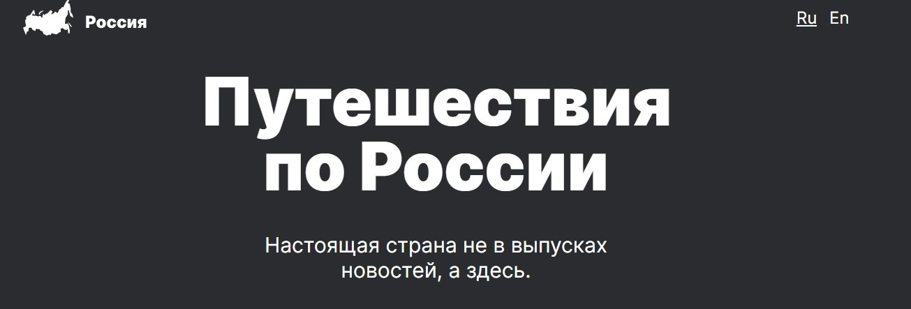

# Путешествие по России
### *Учебный проект от [Яндекс.Практикум](https://practicum.yandex.ru/web/)*

  > *«Ничто так не развивает ум, как путешествие» — Эмиль Золя.* 
  > *«Путешествовать необходимо тем, кто учится» — Марк Твен.*

## Описание проекта
Проект посвящен путешествию по России и создан в рамках прохождения 3 спринта курса Веб-разработчик

## Функционал:
- User eXperience (UX);
- Адаптивный интерфейс для разных устройств.

## Стек технологий:
- HTML5;
- CSS3:
  - Flexbox;
  - Grid Layout;
  - Positioning;
  - Adaptive UI;
  - Media Queries;
- Методология БЭМ;
- Фйловая структура Nested БЭМ;
- Вёрстка по макету в Figma.

 
 

Здесь будет проект о путешествии по России.
В Фигме мы разместили макет, в котором видно, как проект должен выглядеть на самых распространённых разрешениях экранов.
Этот проект сложнее предыдущих, постарайтесь уделить ему больше времени.

 

* [Ссылка на макет в Figma](https://www.figma.com/file/5S2WSbEFL6awjVWJ0NWL8Q/Sprint-3_-Russia-_-desktop-mobile?node-id=28503%3A0)

 ## Ссылка на сайт:
 [на GitHub Pages](https://f4rr311.github.io/russian-travel/index.html)
